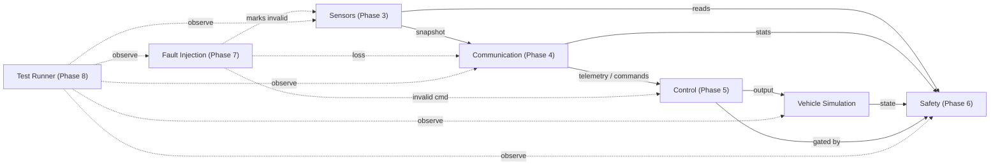

# AgriLink — Embedded Vehicle Control ECU

An ESP32-based embedded vehicle-control ECU prototype built with ESP-IDF, FreeRTOS, and Wokwi simulation. The project models the software architecture of a Vehicle Control ECU for a simulated agricultural machine: a deterministic FreeRTOS task graph that reads sensors, exchanges telemetry and commands over a communication bus, generates and validates motion control, supervises safety, injects deterministic faults, and self-verifies through a runtime test runner.

## 🚀 Live Simulation

[▶ Run AgriLink Live in Wokwi](https://wokwi.com/experimental/viewer?diagram=https%3A%2F%2Fraw.githubusercontent.com%2Fsriram1916%2FAGRILINK%2Fmaster%2Fsimulation%2Fdiagram.json&firmware=https%3A%2F%2Fraw.githubusercontent.com%2Fsriram1916%2FAGRILINK%2Fmaster%2Fsimulation%2Ffirmware.bin)

Run the actual AgriLink ESP32 firmware directly in the browser using Wokwi.
## Key implemented capabilities

- **ESP32 / ESP-IDF** target (`esp32dev` / ESP-IDF via PlatformIO)
- **FreeRTOS task-based architecture** with explicit per-subsystem priorities (`firmware/rtos/agri_rtos.h`)
- **System boot and state management** — `INIT -> READY` transition driven by the boot task
- **Heartbeat monitoring** — periodic state log and GPIO2 LED toggle
- **Sensor simulation** — deterministic GPS, IMU, and wheel-speed snapshots with validity flags (`firmware/sensors/`)
- **Communication subsystem** — transport-agnostic message layer with a Wokwi loopback transport (`firmware/communication/`)
- **CRC validation** — Fletcher-16 checksum validation on received messages
- **Deterministic control layer** — command generation, communication round-trip, validate/clamp, and actuation (`firmware/control/`)
- **Safety supervision and gating** — monitors sensors, communication, and vehicle state; gates and zeroes unsafe control outputs (`firmware/safety/`)
- **Deterministic fault injection** — scheduled GPS-loss, communication-loss, and invalid-command faults (`firmware/fault_injection/`)
- **Test runner** — runtime observer emitting `[TEST] … PASS|FAIL` lines (`firmware/tests/`)
- **Wokwi simulation** — `simulation/diagram.json` + `simulation/wokwi.toml` running the ESP32 DevKitC V4

## High-level architecture



Data flows Sensors -> Communication -> Control -> Vehicle Simulation. Safety reads the latest sensor snapshot, communication statistics, and simulated vehicle state, and gates the Control output (zeroing it when unsafe) before it reaches the vehicle simulation. Fault Injection deterministically perturbs Sensors/Communication/Control; the Test Runner observes every subsystem through existing getters without modifying behavior.

## Project phases

These are development phases for the repository, distinct from the runtime boot-stage log labels (e.g. `[AGRILINK] System boot - Phase 1/2/3 …`), which are merely chronological log tags printed by `app_main` and the boot task.

| Phase | Area | Summary |
|-------|------|---------|
| 1 | Foundation | ESP32 boot, FreeRTOS startup, initial `INIT` state, heartbeat task and GPIO2 LED. |
| 2 | ESP32 / FreeRTOS / Wokwi | Boot state transition `INIT -> READY`, GPIO2 LED heartbeat, serial output in Wokwi. |
| 3 | Sensors | Deterministic GPS/IMU/wheel-speed snapshots with validity flags. |
| 4 | Communication | Message framing, loopback transport, TX/RX, and Fletcher-16 CRC validation. |
| 5 | Control | Deterministic command generation, communication round-trip, validate/clamp, and actuation. |
| 6 | Safety | Supervisor evaluating sensor, communication, and vehicle-speed conditions and gating the control output (normal / degraded / safe-stop / emergency-stop). |
| 7 | Fault Injection | Deterministic, scheduled faults (GPS loss, communication loss, invalid command) with one-cycle observable effects. |
| 8 | Testing | Runtime test runner observing Phase 2–7 behavior via existing getters. |

The `firmware/mission/`, `firmware/navigation/`, and `firmware/diagnostics/` modules are present in the build as lightweight scaffolds but are not yet implemented as production logic.

## Technical stack

| Layer | Technology |
|-------|-----------|
| Hardware | ESP32 DevKitC V4 |
| Framework | ESP-IDF (via PlatformIO) |
| Build | PlatformIO, `esp32dev` environment |
| RTOS | FreeRTOS (ESP-IDF) |
| Simulation | Wokwi (VS Code Wokwi extension) |
| Language | C / C++ |

## Repository structure

```text
AgriLink/
├── CMakeLists.txt            # top-level ESP-IDF project
├── platformio.ini            # PlatformIO esp32dev env + Wokwi post-build hook
├── sdkconfig.esp32dev        # ESP-IDF config (2 MB flash target)
├── .gitignore
├── .vscode/                  # extensions.json (recommended); launch.json and c_cpp_properties.json are ignored
├── src/
│   ├── CMakeLists.txt        # component sources (globs firmware/**/*.cpp)
│   └── main.cpp              # app_main: init + RTOS task creation
├── include/
│   └── agri_types.h          # shared types
├── firmware/
│   ├── rtos/agri_rtos.h      # task priorities
│   ├── heartbeat/            # Phase 1-2
│   ├── sensors/              # Phase 3
│   ├── communication/        # Phase 4
│   ├── control/              # Phase 5
│   ├── simulation/           # Phase 5 vehicle model
│   ├── safety/               # Phase 6
│   ├── fault_injection/      # Phase 7
│   ├── tests/                # Phase 8
│   └── mission/, navigation/, diagnostics/   # scaffolds
├── simulation/               # Wokwi diagram.json + wokwi.toml
├── scripts/
│   └── wokwi_postbuild.py    # regenerates firmware.bin with the flash layout Wokwi expects
├── docs/
├── architecture/
```

## Build

From the repository root:

```
pio run -e esp32dev
```

Artifacts are produced under `.pio/build/esp32dev/` (`firmware.bin`, `firmware.elf`, `bootloader.bin`, `partitions.bin`). The post-build hook `scripts/wokwi_postbuild.py` (registered in `platformio.ini` as `extra_scripts = post:scripts/wokwi_postbuild.py`) rewrites `firmware.bin` with the ESP-IDF flash layout Wokwi requires — bootloader at `0x1000` (with `0xFF` padding), partition table at `0x8000`, application at `0x10000` — and writes a corrected `flasher_args.json` referencing bare filenames.

## Wokwi simulation

Open the `simulation/` folder in VS Code with the Wokwi extension installed and start the simulator (Wokwi reads `simulation/wokwi.toml` and `simulation/diagram.json`). The circuit is an ESP32 DevKitC V4 with a green status LED on GPIO2 (driven by the heartbeat task), a push button on GPIO0, and UART wired to the Wokwi serial monitor.

## Verification / evidence

Wokwi runtime verification of the ESP32 DevKitC V4 simulation demonstrated:

- System boot and the `INIT -> READY` state transition
- Heartbeat task logging and GPIO2 LED toggling
- Changing sensor values (GPS lat/lon, IMU, wheel speed)
- Communication TX and RX over the loopback transport
- CRC validation on received telemetry/commands (no CRC errors under normal operation)
- Control command generation, validate/clamp, and vehicle actuation
- Safety gating: the control output was inhibited (speed zeroed) when a gated condition was surfaced
- GPS-loss fault response detected by the safety supervisor
- Communication-loss fault response
- Invalid control-command rejection by the validator

## Testing

Phase 8 adds a runtime test runner (`firmware/tests/test_runner.cpp`) that runs as a FreeRTOS task and emits `[TEST] <check> PASS|FAIL` lines for each observable, finishing with `[TEST] suite_complete pass=X fail=Y`.

The observed Wokwi run reported **7 PASS / 6 FAIL**. The failures are associated with the test runner's observation windows and timing contracts against the deterministic schedules, not with the underlying Phase 2–7 runtime behavior, which was independently observed working as described above. Two root causes were identified during verification:

- Phase 7 faults are one-cycle injections, so their observable effect does not persist across the full Phase 8 check windows that expect a sustained condition (e.g. GPS validity loss is consumed by the next sensor read).
- The Phase 6 deterministic safety test window (12–15 s) overlaps the Phase 8 `recovery_after_gps` check (13–13.8 s), so the supervisor is in a gated `DEGRADED` state exactly when that check expects `NORMAL`.

These are test-observation/timing mismatches. No claim of 13/13 is made; the 7 observed passes plus the independent runtime evidence above are the supported results.

## Limitations and future work

This is a simulation-oriented prototype, **not** production automotive safety software. It does not implement a certified ISO 26262 functional-safety lifecycle, a production ISOBUS stack, autonomous navigation, or real-vehicle actuation. It models a single ESP32 node on a Wokwi loopback bus; it is not a multi-node fleet system. The `mission/`, `navigation/`, and `diagnostics/` modules are scaffolds. Future work: a host-side test harness for deterministic timing, expanded fault scenarios, and real-transport (TWAI/CAN) bindings.

## Why this project matters

It demonstrates core embedded-control engineering concerns in a single deterministic, inspectable target: a prioritized FreeRTOS task graph; modular, replaceable subsystem boundaries (sensor / communication / control / safety layers with clean interfaces); explicit safety gating that prevents unsafe control from reaching the actuator; deterministic fault injection to exercise safety paths; and a built-in runtime self-checker that makes system behavior observable and verifiable in simulation — the same structural concerns that scale to real ECU development, without the production certification and automotive-grade redundancy.
