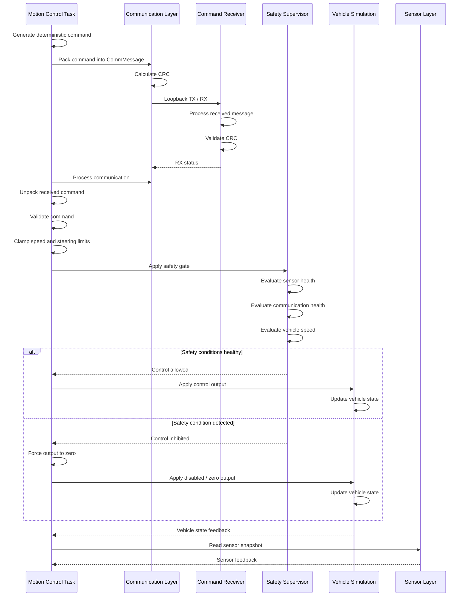

# AgriLink Control Sequence

## Purpose

This document describes the runtime sequence used by the AgriLink embedded vehicle-control ECU when generating, communicating, validating, safety-gating, and applying a vehicle control command.

The sequence is based on the current implementation of the motion-control, communication, safety, vehicle-simulation, and sensor components.

---

## Control Command Sequence



---

## Sequence Description

### 1. Command Generation

The motion-control task periodically generates a deterministic control command.

The current prototype generates:

- desired speed
- steering angle
- enable flag

The command values vary deterministically over time to exercise the control path during simulation.

---

### 2. Command Packing

The generated control command is packed into an `agri::CommMessage`.

The message contains:

- message ID
- message type
- payload length
- command payload
- CRC
- timestamp

The command message uses the command message identifier and `COMMAND` message type defined by the communication layer.

---

### 3. Communication

The communication layer calculates the message CRC and transmits the command.

The current prototype uses a loopback communication path:

```text
TX -> RX -> CRC validation
```

This allows the complete communication and command-processing path to be exercised without requiring external hardware.

---

### 4. Receive and CRC Validation

The received message is processed by the communication layer.

The CRC is checked before the message is considered valid.

A valid received message contributes to the communication statistics used by the safety supervisor.

---

### 5. Command Unpacking and Validation

The motion-control task unpacks the received command and validates the command values.

Validation rejects:

- non-finite values
- raw speed outside the allowed input range

Valid commands are then limited to the configured control range.

Current control limits include:

| Parameter | Limit |
|---|---:|
| Maximum speed | `5.0 m/s` |
| Minimum speed | `-3.0 m/s` |
| Maximum steering | `30 deg` |
| Minimum steering | `-30 deg` |
| Raw speed rejection threshold | `10.0 m/s` absolute |

---

### 6. Safety Gating

The validated control output is passed through the safety supervisor.

The safety supervisor evaluates:

- sensor validity
- communication health
- vehicle simulation speed

If the safety decision does not allow control, the control output is forced to a safe disabled condition.

The current safety gate can:

- disable control
- force commanded speed to zero
- force commanded steering to zero

---

### 7. Vehicle Simulation

When the output passes the safety gate, the resulting control command is applied to the vehicle simulation.

The simulation updates:

- vehicle speed
- steering
- position
- heading
- timestamp

When safety inhibits control, the disabled/zero output is applied instead.

---

### 8. Feedback

After the vehicle simulation update, the motion-control task reads vehicle-state feedback and sensor information.

The feedback is used to observe the resulting system behavior during runtime testing.

---

## Fault Handling in the Control Sequence

The same sequence supports deterministic fault-injection testing.

### Invalid Control Command

A deliberately invalid command can be injected.

The current invalid command test uses a raw speed of approximately:

```text
50.0 m/s
```

The command is rejected by validation and does not become an enabled control output.

### Communication Loss

When communication loss is injected, transmission is suppressed.

The safety supervisor observes the communication fault and inhibits control.

### GPS Loss

When GPS loss is injected, the sensor validity becomes false.

The safety supervisor detects the unhealthy sensor condition and inhibits control.

---

## Engineering Sequence Summary

```text
Generate
   |
   v
Pack
   |
   v
Transmit
   |
   v
Receive
   |
   v
CRC Check
   |
   v
Unpack
   |
   v
Validate
   |
   v
Clamp
   |
   v
Safety Gate
   |
   +------ Unsafe ------> Zero / Disable
   |
   +------ Safe --------> Vehicle Simulation
                              |
                              v
                         Feedback
```

---

## Current Prototype Scope

This sequence diagram documents the control flow currently implemented in the AgriLink prototype.

The communication path is currently transport-agnostic and uses loopback simulation rather than a physical vehicle network.

The vehicle simulation represents the actuator/vehicle response for development and testing.

This document is intended as an engineering design and review artifact and does not represent a production-machine control specification.
