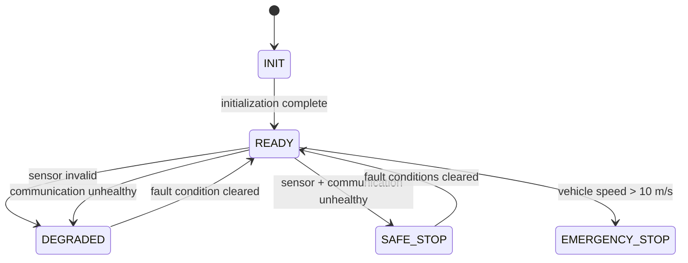
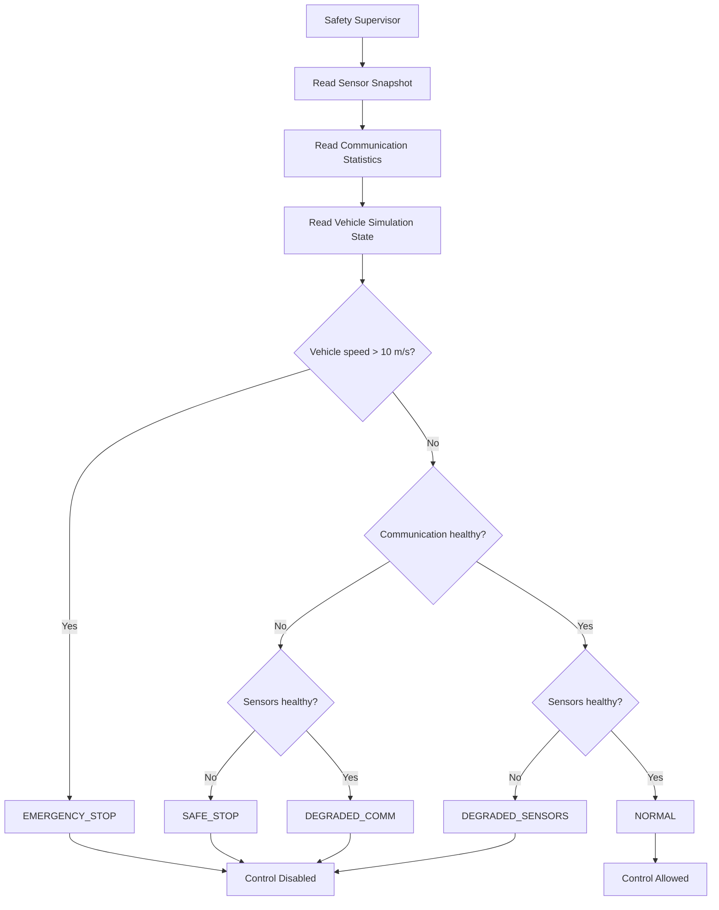
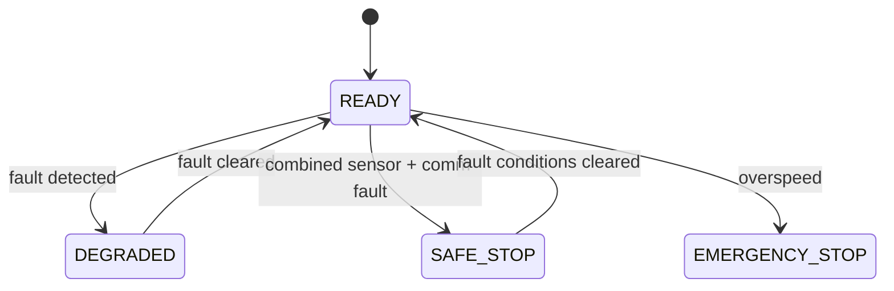

# AgriLink System State Machine

## Purpose

This document describes the vehicle-level state behavior of the AgriLink embedded vehicle-control ECU.

The state model is based on the current implementation of the safety supervisor, vehicle state definitions, and heartbeat/system-state reporting.

The design separates three concepts:

- `VehicleState` - the vehicle operating/safety state.
- `SafetyStatus` - the result of the safety supervisor evaluation.
- `SystemState` - the high-level heartbeat/system status reported by the ECU.

---

## Safety Decision Mapping

| Condition | Safety Status | Vehicle Target State | Control Allowed |
|---|---|---|---|
| All monitored conditions healthy | `NORMAL` | `READY` | Yes |
| Sensor invalid | `DEGRADED_SENSORS` | `DEGRADED` | No |
| Communication unhealthy | `DEGRADED_COMM` | `DEGRADED` | No |
| Sensor and communication unhealthy | `SAFE_STOP` | `SAFE_STOP` | No |
| Vehicle speed exceeds 10 m/s | `EMERGENCY_STOP` | `EMERGENCY_STOP` | No |

The safety supervisor evaluates the current sensor snapshot, communication health, and simulated vehicle state before allowing control output.

---

## Vehicle State Machine

### State Descriptions

### INIT

Initial ECU state during system startup.

The system initializes the heartbeat subsystem, sensors, communication, control, simulation, safety supervisor, and test infrastructure.

Transition:

`INIT -> READY`

when initialization is complete.

### READY

Normal operating state.

The safety supervisor allows control output when monitored conditions are healthy.

### DEGRADED

A monitored subsystem has become unhealthy while the vehicle remains below the emergency overspeed threshold.

Examples:

- GPS/IMU/wheel sensor invalid.
- Communication link unhealthy.

The safety supervisor inhibits control output until the fault condition clears.

### SAFE_STOP

Entered when both sensor health and communication health are considered unsafe.

Control output is disabled and commanded speed/steering are forced to zero.

### EMERGENCY_STOP

Highest-priority safety state in the current prototype.

It is triggered when simulated vehicle speed exceeds:

`10.0 m/s`

Control is disabled and the commanded output is forced to zero.

---

## Safety Evaluation Flow

---

## Safety Gate

The safety supervisor is positioned between command validation and vehicle actuation.

Command
↓
Validation / Limiting
↓
Safety Supervisor
↓
Unsafe → Zero Output / Disable Control
Safe → Vehicle Simulation

The safety supervisor therefore acts as the final control-output gate in the current prototype.

---

## Control Enable Is Not a Vehicle State

`CONTROL ENABLED` is treated as a safety/control decision rather than a `VehicleState`.

The current `VehicleState` enumeration is:

`INIT, READY, AUTONOMOUS, DEGRADED, FAULT, SAFE_STOP, EMERGENCY_STOP, RECOVERY`

The current safety supervisor directly transitions the system to:

`READY, DEGRADED, SAFE_STOP, EMERGENCY_STOP`

The following states exist in the common vehicle-state definition but are not currently transitioned by the safety supervisor:

`AUTONOMOUS, FAULT, RECOVERY`

They remain available for future expansion of the vehicle operating-state model.

---

## Recovery Behavior

The current prototype does not implement a separate recovery procedure or operator acknowledgement sequence for every safety state.

Therefore, this diagram represents the recovery behavior currently implemented rather than a production-machine recovery specification.

---

## Heartbeat System-State Mapping

The heartbeat subsystem maintains a separate high-level `SystemState`.

The safety supervisor maps vehicle safety conditions to heartbeat status as follows:

| Vehicle Target State | Heartbeat System State |
|---|---|
| `READY` | `READY` |
| `DEGRADED` | `WARNING` |
| Other safety/error states | `ERROR` |

The heartbeat task periodically reports the current system state and toggles the status LED.

---

## Safety Design Principle

The control path follows this principle:

Sensor / Communication Information
↓
Safety Evaluation
↓
Safety Decision
↓
Control Output Gate
↓
Safe → Vehicle Output
Unsafe → Zero Output

This ensures that an unsafe condition can inhibit the control command before it reaches the vehicle simulation/actuation layer.

---

## Current Prototype Scope

This state machine documents the behavior implemented in the AgriLink prototype.

It is intended as an engineering design artifact for understanding, reviewing, and testing the embedded control system.

It should not be interpreted as a production safety certification artifact or as a complete machine-safety specification.

Future development could extend the model with:

- explicit autonomous operating states
- fault and recovery management
- operator acknowledgement
- actuator feedback
- watchdog handling
- additional sensor disagreement states
- commissioning-specific operating modes
